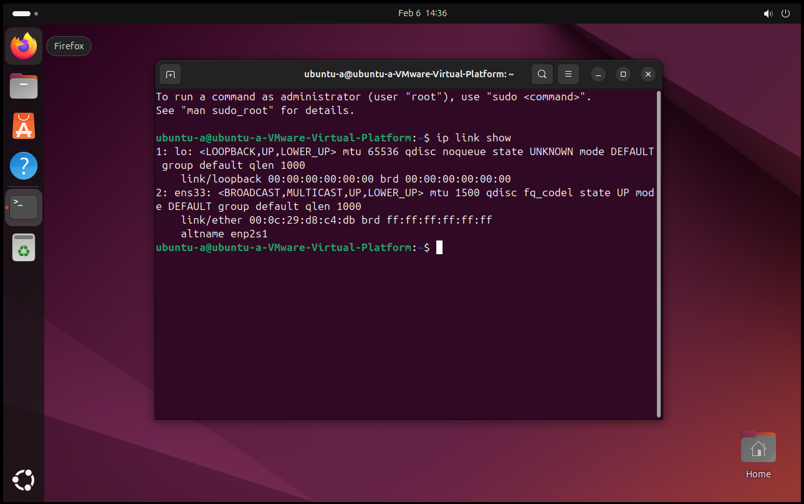
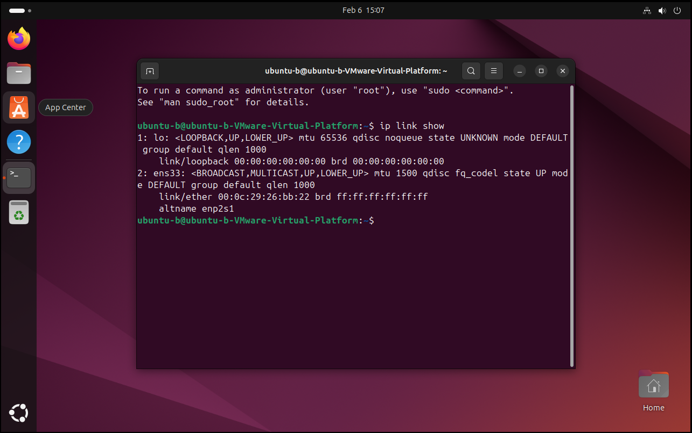
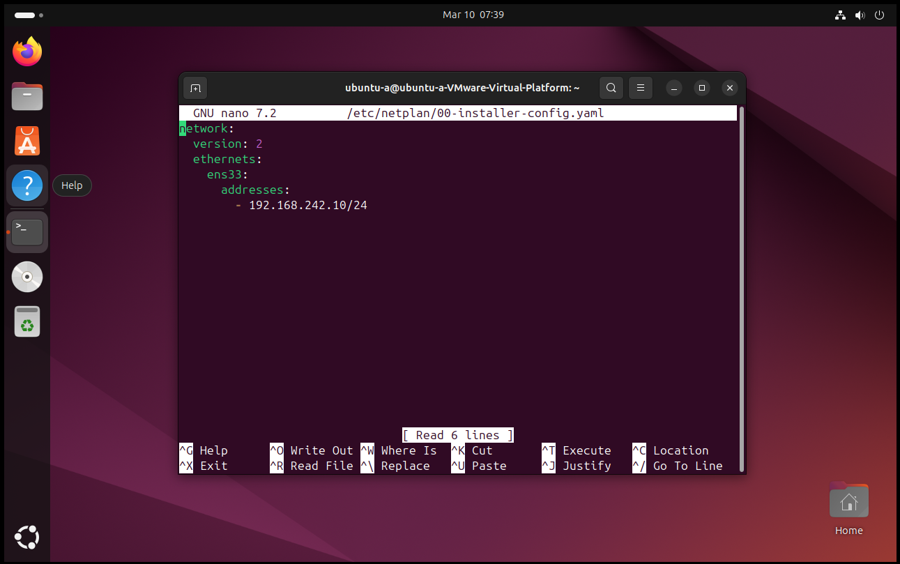
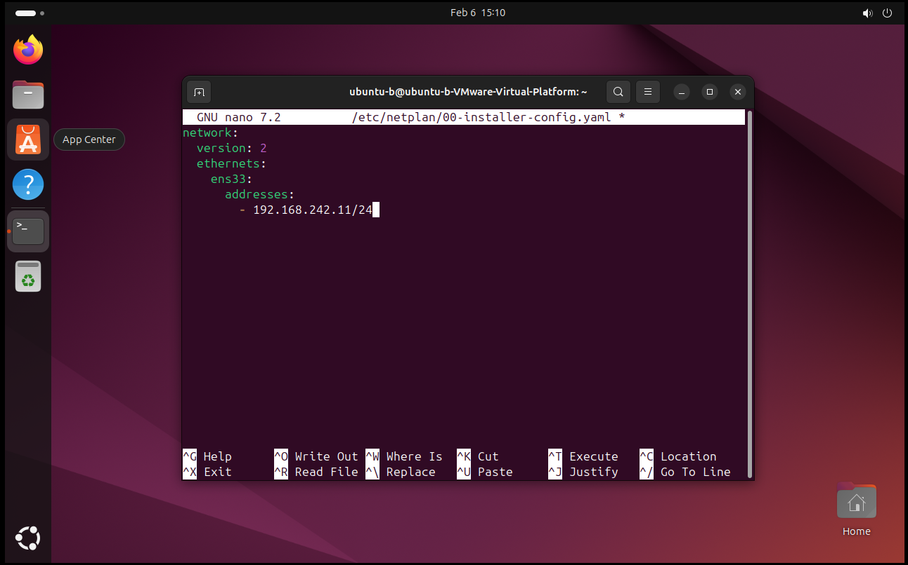
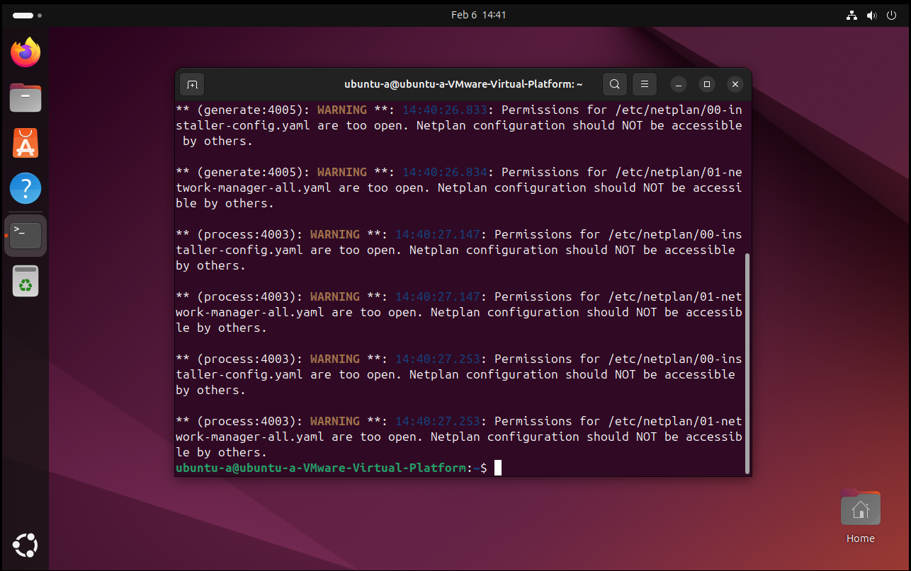
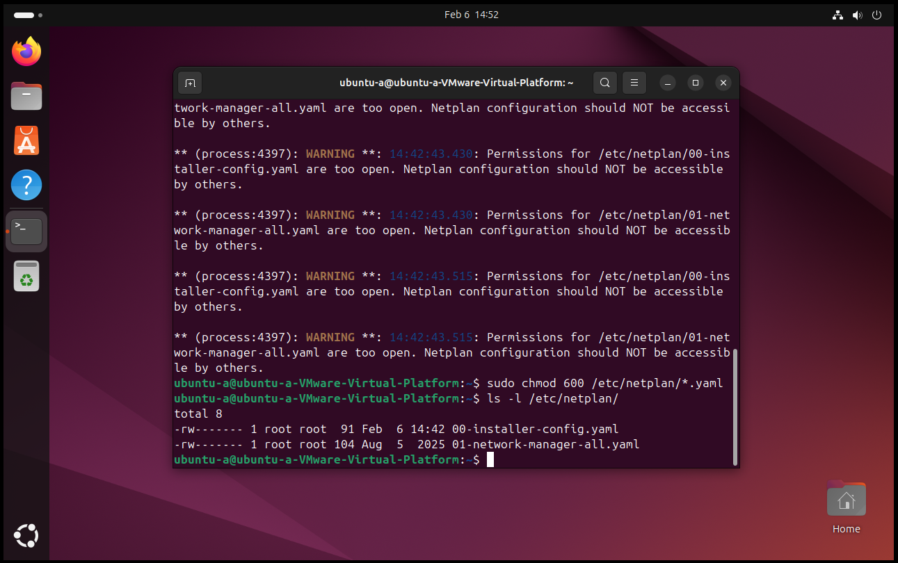
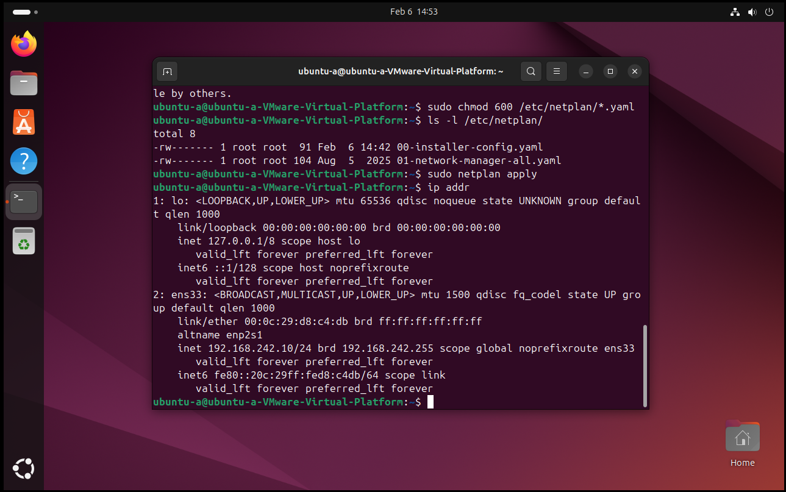
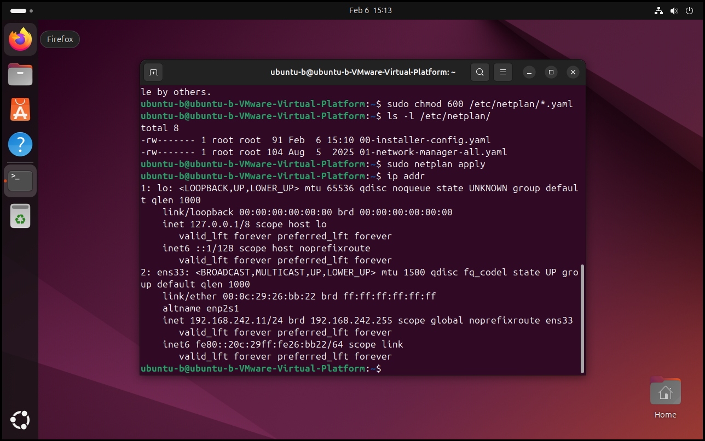
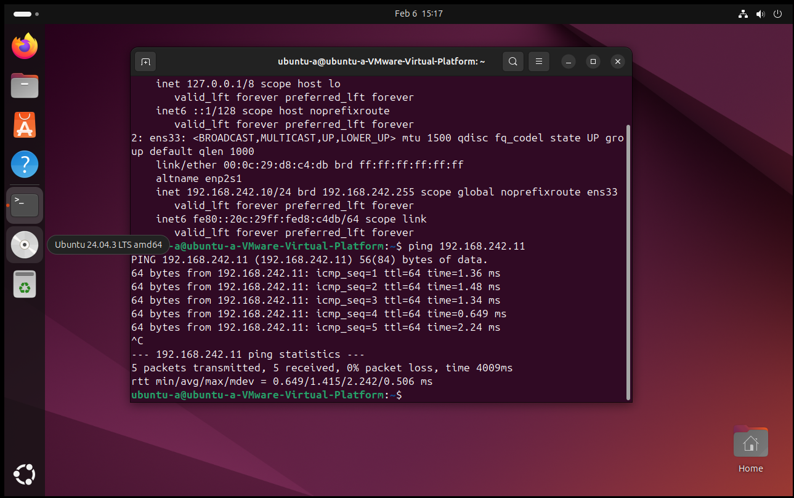
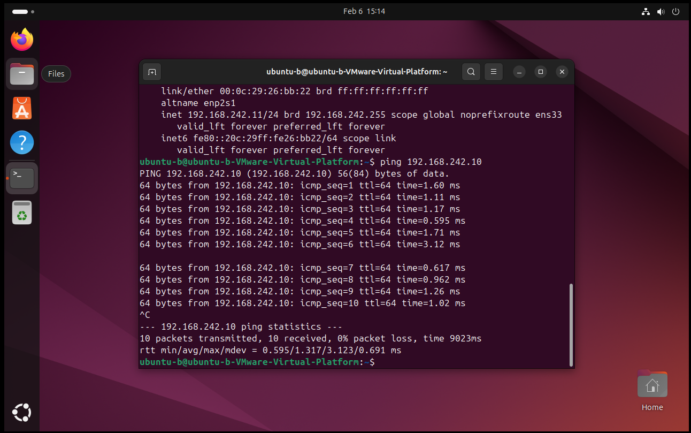

# Ubuntu Linux Network & Connectivity Lab
Establishing a functional virtual network between two Ubuntu Linux VMs to practice static IP configuration.

## Environment & Specifications
* **Goal**: Establish a functional virtual network between two Ubuntu Linux VMs.
* **Platform**: VMware Workstation (VMnet1 Host-Only) using Ubuntu 24.04.3 VMs.
* **Network Type**: Host-Only (VMnet1) treated as a “sandbox” for isolation.
* **Subnet**: 192.168.242.0/24 with DHCP Disabled.

---

## 1. Interface Identification
I began by inputting the command `ip link show` to identify the active interface.

* **Ubuntu-A**: 
* **Ubuntu-B**: 

## 2. Static IP Configuration
I created a netplan and edited it with nano by inputting the command `sudo nano /etc/netplan/00-installer-config.yaml`.
* **VM-A**: IP Address 192.168.242.10.
* **VM-B**: IP Address 192.168.242.11.

* **Configuring VM-A**: 
* **Configuring VM-B**: 

## 3. Security Hardening (Problem & Solution)
I tried applying the netplan and got a warning that the permissions were too “loose” and not secure enough. The root user should be the only one with read/write permissions.

* **The Conflict**: 

I changed the permissions by inputting `sudo chmod 600 /etc/netplan/*.yaml` and verified the correct permissions with `ls -l /etc/netplan/`.

* **The Fix**: 

## 4. Connectivity Verification
I applied the netplan and verified it by inputting `ip addr` to view the correct static address. Once finished with both VMs, I pinged each one and it was a success!

* **VM-A Verification**: 
* **VM-B Verification**: 
* **Ping (A to B)**: 
* **Ping (B to A)**: 
